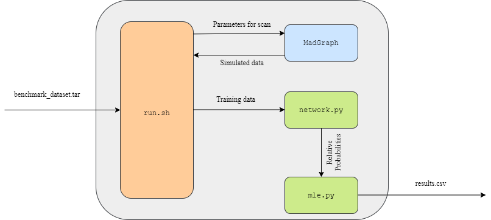
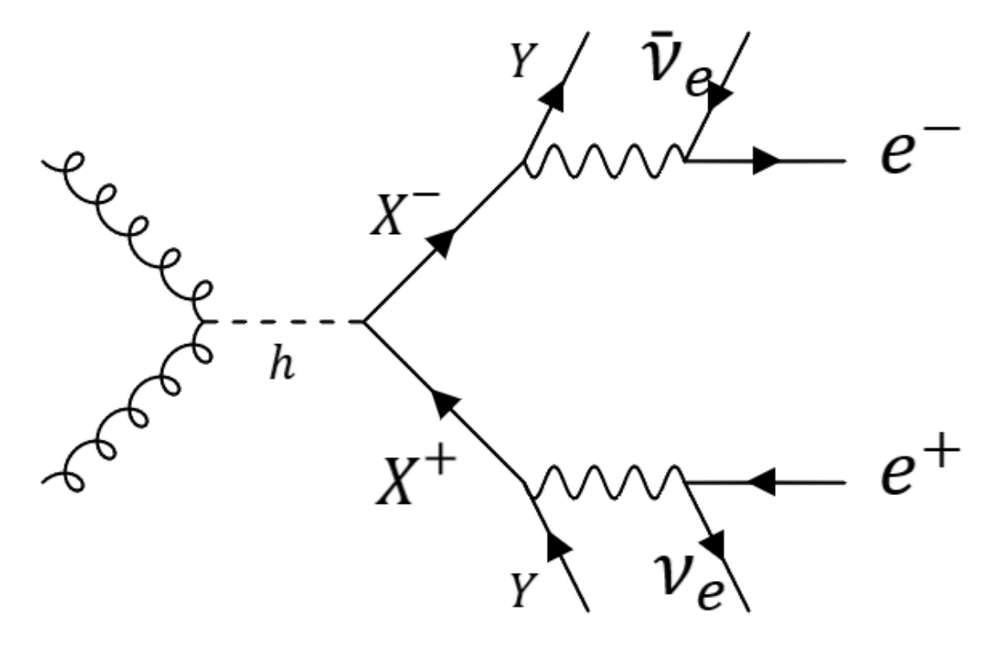
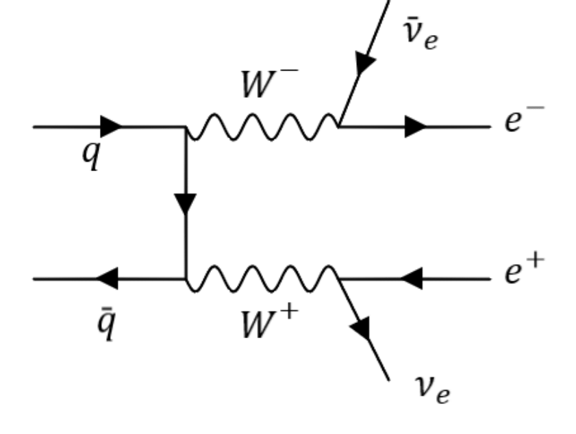

# Madgraph_Search

## Installation Instructions
1. Code to automatically generate hypotheses and search for parameters using MadGraph
2. Requires Madgraph: [MG5](https://launchpad.net/mg5amcnlo)
3. Save this folder under Madgraph Directory to implement the search
4. To start the scan the user needs to run "run.sh" from terminal from the Madgraph_Search directory
5. All instructions consolidated in shell script to facilitate job submissions on cluster

## Introduction to the hypothesis
The Lagrangian for the hypotheses is given by

$$  \mathcal{L} = \mathcal{L}_{SM} + y_X H \bar{X}{X} + y_Y H \bar{Y}{Y} + \frac{g'g_W}{2\sqrt{2}}\bar{X}{W}^{-}Y + h.c. $$

where $y_X$, $y_Y$ and $g'$ are the parameters to be estimated from the benchmark dataset.  Typically such a multi-dimensional scan must be run on a cluster, due to the computational cost. As a proof of concept, this code searches for the parameter $y_X (M_X)$.

This model corresponds to a typical BSM hypothesis where traditional one-dimensional scans based on variables such as MET are not as effective as using all the kinematic information in an event. The final state of interest has an electron-positron pair with missing transverse energy.

The same final state is achieved in the Standard Model with neutrinos carrying the MET.

## Neural Network Analysis
DNNs are implemented as binary classifiers. They are trained to discriminate between signal for a particular choice of parameters and the background. The DNNs are fully connected and use ReLu in the hidden layers, sigmoid in the output layer. 

Binary-CrossEntropy is chosen as the loss function:

$$BCE[f] = -\int dx \left[p_{A}(x)\log{f(x)} + p_{B}(x)\log{(1-f(x))}\right]$$

Analytically, it can be seen that, the function that minimizes the BCE is given by:

$$ f^*(x) = \frac{p_{A}(x)}{p_{A}(x) + p_{B}(x)} $$

## Bayesian Analysis (MLE)

For a given choice of parameters $\theta$, there are two hypotheses:

1. Signal Hypothesis: There are S signal events and B background events in the data-set:

$$ p(x|\theta, \mu) = \mu p_{sig}(x|\theta) + (1 - \mu) p_{bg}(x) $$
 
 where, $\mu = S/(S + B)$ is also a parameter to be estimated.

2. Null Hypothesis:
       
$$  p_0(x) = p_{bg}(x) $$
    
If a DNN is trained to classify between signal and background classes, using Equation 3, the output of the network $f(x|\theta)$ can be used to obtain:

$$ \frac{p(x|\theta, \mu)}{p_0(x)} = (1 - \mu) + \frac{\mu f(x|\theta)}{1 - f(x|\theta)}  $$

Maximum-Log-Likelihood estimation can be done using:

$$ \hat{\theta}, \hat{\mu} = \underset{\theta, \mu}{\mathrm{argmax}}\sum_i \log{\left [(1 - \mu) + \frac{\mu f(x_i|\theta)}{1 - f(x_i|\theta)}  \right]} $$
